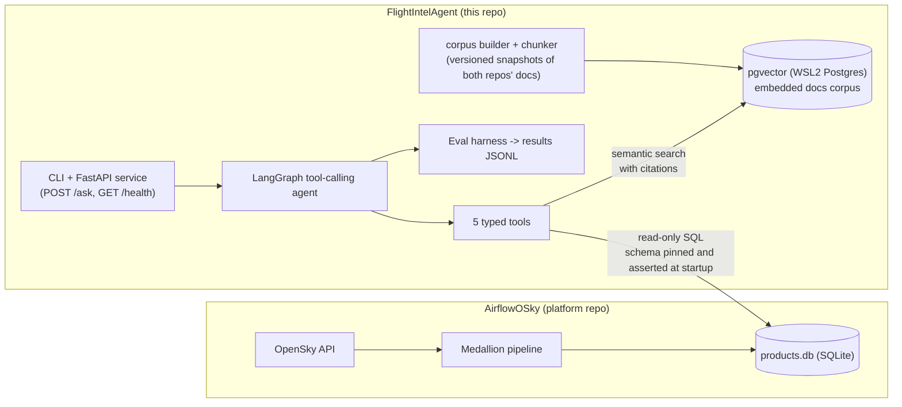
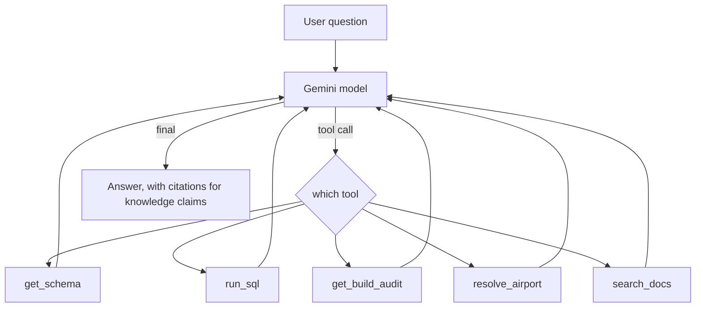
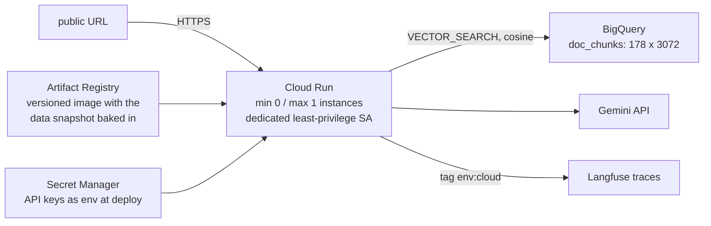

# FlightIntel Agent - Architecture Overview

A Gen AI application layer over a live flight-data platform. The system
answers natural-language analytics questions about aircraft activity over
Bangkok through a tool-calling LLM agent with two paths - live SQL for
data questions, cited semantic search for knowledge questions - and an
evaluation harness that measures both paths per failure category, per
model, per prompt version, per corpus version. Since phase 4 the same
agent serves from Google Cloud Run behind a public URL, traced end to
end.

## System context

The contract is the database schema, pinned and asserted at startup.

The split mirrors a real organization: a platform team owns the pipeline,
an AI team owns the agent, and the interface between them is a data
contract, not shared code. The consumer asserts the pinned schema at
startup and fails loudly on drift: strict inside the six contract tables
(a silently added column changes what `SELECT *` exposes to the model),
tolerant outside them (upstream may grow without breaking the consumer).

## The data contract

Six tables in two halves, each half built by an independent pipeline:

| Table | Grain (what one row means) |
|---|---|
| flights | one reconstructed flight (aircraft, first/last seen, est. airports) |
| od_hourly | one origin-destination pair in one UTC hour, with flight_count |
| states | one position report (aircraft, time, lat/lon, altitude, velocity) |
| heatmap_hourly | one rounded grid cell in one UTC hour, with obs and aircraft counts |
| build_audit | one flights-half pipeline run (records read, rejected, written) |
| build_audit_states | one states-half pipeline run |

The contract's sharp edges are documented upstream and drive both the
agent's system prompt and the eval design: grain discipline, UTC vs
Bangkok +7, gate awareness (gold tables exclude rejected records),
measure discipline (distinct counts do not sum), grids do not nest, and
sparse coverage (absent hours mean "not captured", never "no traffic").

## The agent

A LangGraph prebuilt ReAct-style loop; the framework owns only the loop,
while the domain logic lives in five framework-independent,
Pydantic-typed tools. One loop, no router node: the model routes data
vs knowledge questions by tool description, and mixed questions simply
use both paths (PHASE2_PLAN Q9).

- **get_schema** - table columns plus each table's grain sentence, so the
  model reads the grain next to the columns at query time.
- **run_sql** - guarded execution: single SELECT-only statement,
  allowlist, row cap, timeout, on a read-only connection.
- **get_build_audit** - recent pipeline runs from both audit tables, for
  data-quality questions.
- **resolve_airport** - static name/city/ICAO lookup.
- **search_docs** - semantic search over the embedded docs corpus:
  returns chunk text, provenance breadcrumb, citation id, and cosine
  distance; errors return in-result so a dead vector store degrades the
  docs path without touching the SQL path.

Design properties:

- **Read-only by construction.** The upstream DB opens with SQLite's
  `mode=ro` plus `PRAGMA query_only`; nothing this repo persists touches
  the upstream file.
- **Typed error contract.** Malformed tool inputs fail at the Pydantic
  boundary (caller bug); correctable execution failures return structured
  error results the model may retry once, then the agent aborts honestly.
- **Versioned prompt.** The system prompt carries the six contract
  caveats and is versioned; every eval result records the prompt version
  and exact model id that produced it.
- **Bounded loop.** The recursion limit was set from measured
  rounds-to-answer on real questions, not guessed; the abort path is
  detected and reported as a structured "could not answer".
- **Cost as a metric.** Every answer records LLM requests and input and
  output tokens next to the answer itself.
- **Traced when configured (phase 3).** With Langfuse keys in .env,
  every run ships a full trace (each LLM call, tokens, latency) under a
  client-side trace id the answer carries; the CLI prints the trace
  link. Without keys the agent runs byte-identical and untraced - the
  same additive-degradation pattern as the vector store.

## The RAG path (phase 2)

Documentation from both repos becomes a versioned, queryable knowledge
space; honesty is enforced by structure, not by trust:

- **Pinned corpus snapshots.** The corpus builder collects ONLY
  git-tracked markdown (private files are structurally excluded) into a
  versioned snapshot whose manifest records source commits. Eval numbers
  compare only within a corpus version; a refresh is a recorded event.
- **Measured chunking.** Whole-file chunks when a file fits the cap
  (every ADR does, so options and decision travel together); recursive
  heading splits above it; bold-label Q&A blocks split into their own
  chunks since corpus v2, each with a citable id naming the exact
  question (Q3, Q14 in the phase plan).
- **Two vector stores, one contract.** Dev: Postgres 17 + pgvector
  inside WSL2 (port 5433). Cloud: BigQuery vector search over the SAME
  vectors, copied by export (never re-embedded). Both sit behind the
  identical typed search_docs contract, selected by environment; exact
  scan at this scale on both engines (no ANN index: a recorded choice
  on pgvector, a hard threshold on BigQuery); embedding model and
  dimensions pinned in each store's index manifest (ADRs 0007, 0008,
  0010).
- **Citations are chunk ids.** search_docs returns them, the prompt
  cites only ids returned in-conversation, the answer parser extracts
  retrieved and cited id lists, and the eval asserts cited is a subset
  of retrieved before any judged metric runs. The CLI flags invented
  citations on every answer.

## The evaluation harness

Evals ship with features: a capability lands together with its eval
cases, and a prompt or model change without an eval run is not done.

- **Trap categories from the contract.** Twenty cases across baseline,
  grain, timezone, gate, measure, grid, and refusal categories; every
  trap corresponds to a documented upstream rule the model could violate.
- **Executable ground truth.** Expected values are SQL executed against
  the same database at run time, so the dataset survives upstream data
  growth without frozen numbers rotting.
- **Machine-readable answers.** The runner appends one neutral
  instruction so answers end with a FINAL_ANSWER line; the scorer reads
  only that line. Production and eval share the same generation path.
- **Honest refusals are scored.** Refusal cases pass only if the agent
  declines and names the correct reason.
- **Quota-aware operation.** Incremental JSONL results with resume,
  exponential backoff on 429, targeted re-runs by case id.

The RAG path adds a second, layered harness: deterministic checks run
first and free (recall@k against hand-picked gold sources, cited ids a
subset of retrieved ids), then RAGAS (faithfulness, answer relevancy,
context precision, context recall) judges the categories where judged
metrics are meaningful, with the judge model id recorded per run
(PHASE2_PLAN Q10-Q12).

Measured results (gemini-3.5-flash):

- SQL traps, 20 cases, one iteration day: 60% under prompt v1 to a
  confirmed 90% under prompt v2; both remaining failures diagnosed to
  one root cause, one recorded as a model capability finding.
- RAG baseline, 12 cases, corpus v1: 9/12 deterministic, RAGAS means
  0.87-0.93, zero invented citations; all three failures are recorded
  system findings (adjacency bait, corpus-negative paralysis, an eval
  design flaw), not harness bugs.
- Corpus v1 to v2: the seed probe's gold source moved from rank 9 to
  rank 1 by splitting one diluted Q&A chunk (the measured re-chunk).
- pgvector to BigQuery (phase 4): fixed-query rankings identical with
  distances equal to four decimals; the full RAG suite passed 9/13 on
  both engines with the identical failure set - the backend swap was
  proven invisible before it served anyone.

## The cloud deployment (phase 4)

- **The data rides in the image.** products.db (14 MB) is baked into a
  deploy-tagged image variant; the tag records the snapshot date, and a
  data refresh is a rebuild - staleness is a readable property, not a
  surprise. The app still opens it read-only.
- **Identity is ambient, never a key file.** Locally the BigQuery
  client loads the developer's ADC file explicitly; on Cloud Run the
  same code resolves the runtime service account from the metadata
  server. That account can read one table, run query jobs, and access
  its three secrets - nothing else.
- **Cost by construction**: scale-to-zero when idle, max-instances 1 as
  the spend cap on a public endpoint, free tiers doing the real work,
  and cost-per-query recorded from traces (boot-to-serving 9.2s; a
  warm cited answer 11.5s / 3 LLM requests; ~$0.00006 per doc search
  at BigQuery's 10 MB billing minimum).

## Roadmap

| Phase | Deliverable |
|---|---|
| 1 (done) | LangGraph agent core (SQL path) + trap-eval harness on SQLite |
| 2 (done) | RAG path: pgvector, embeddings over both repos' docs with citations, RAGAS |
| 3 (done) | Langfuse tracing, FastAPI service, Docker (app-only image, Engine in WSL) |
| 4 (done) | GCP: Cloud Run + BigQuery vector search, re-proven, traced, public URL |

## Key decisions (ADR index)

| ADR | Decision |
|---|---|
| 0001 | Separate consumer repo; the schema is the contract, no shared code |
| 0002 | Cost policy: free-tier development, spend limits before paid calls |
| 0003 | SQLite first; Postgres arrives with the RAG phase |
| 0005 | LangGraph from v1; the abstraction cost is paid in a written ledger |
| 0006 | Gemini + GCP alignment for the target role profile |
| 0007 | Vectors live in local pgvector; products stay in upstream SQLite |
| 0008 | pgvector runs in WSL2 Ubuntu (port 5433), not a Docker container |
| 0009 | Langfuse cloud free tier (US region), not self-hosted |
| 0010 | BigQuery vector search in the cloud; pgvector stays the dev store |
