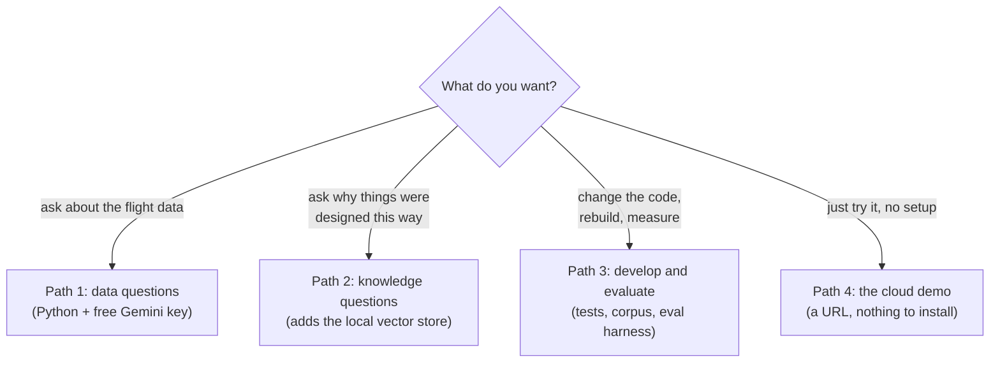

# FlightIntelAgent - user guide (start here if you are new)

Status: v1.2, updated 2026-08-13 (phase 4: cloud). This guide assumes
ZERO knowledge of the project and grows with each phase. It puts the
agent in your hands; the project's story is PRESENTATION.md; how the
system works inside is ARCHITECTURE_OVERVIEW.md. The data itself comes
from the upstream AirflowOSky project, which has its own guide
(docs/USER_GUIDE.md over there).

## What this project gives you

FlightIntelAgent is an AI analyst for the Bangkok airspace data that
AirflowOSky captures from the OpenSky Network. You ask questions in plain
English at a command line and get:

1. **Data answers computed live.** "Which airport pair was busiest?"
   becomes real SQL against the products database. The answer shows the
   SQL it ran, so you can check the work. Never answered from memory.
2. **Knowledge answers with citations.** "Why are vectors stored in
   pgvector?" is answered from an embedded corpus of both projects'
   committed documentation, with citations that point at the real source
   files. Invented citations are detected and flagged.
3. **Honest failure.** If the data cannot answer (a date was never
   captured, a table excludes what you asked about), the agent says so
   and names the reason. If the docs index is down, it says the docs
   could not be searched. A refusal with a reason is correct behavior
   here, not a bug.

Every run prints what it cost: the model id, the prompt version, how many
LLM requests, how many tokens. Cost is a metric in this project, not an
afterthought.

## Choose your path



## Path 1: data questions

You need: Windows (or adapt the paths), Python 3.11+, git, and a free
Gemini API key from Google AI Studio (https://aistudio.google.com). The
free tier is enough for everything in this guide; the AI Studio usage
meter shows every request you spend.

1. **Setup** (one time, free):

   ```
   git clone https://github.com/MawingMawet/flightintel-agent
   cd flightintel-agent
   py -m venv .venv
   .venv\Scripts\python.exe -m pip install -e .[dev]
   copy .env.example .env
   ```

   Edit `.env`: paste your key into `GEMINI_API_KEY`. For
   `FLIGHT_DB_PATH` you have two options:

   - No upstream checkout? Point it at the committed sample:
     `FLIGHT_DB_PATH=evals/fixtures/sample.db` (a real-data subset,
     works out of the box).
   - Have AirflowOSky locally? Point it at your built
     `data/processed/products.db`. It is opened read-only, always.

2. **Ask** (each question spends roughly 2-4 LLM requests, free tier):

   ```
   .venv\Scripts\python.exe -m flightintel.cli "Which airport pair was busiest, and in which hour?"
   ```

   The question goes inside the quotes, as one argument to the command;
   flags like `--trace` go outside the quotes, at the end. The terminal
   itself does not understand English - typing a bare question at the
   prompt makes the shell look for a program named after your first
   word.

   The output is the answer, the SQL the agent ran, and the cost line.
   Two flags worth knowing:

   - `--trace` prints the agent's raw message list, annotated: watch it
     call tools, read results, and decide it is done. This is the best
     five minutes you can spend understanding how a tool-calling agent
     actually works.
   - `--json` prints the full structured answer (for scripts).

3. **Try a question the data cannot answer**, for example a date before
   capture started. The correct response is a refusal citing coverage.
   The data is capture sessions, not continuous surveillance: an absent
   hour means "not captured", never "no traffic".

## Path 2: knowledge questions

Knowledge questions ("why did we choose X", "what does this caveat
mean") need the local vector store: PostgreSQL + pgvector holding an
embedded snapshot of both repos' committed docs.

On this project's dev machine that store runs inside WSL2 (Ubuntu-22.04)
on port 5433. `scripts/setup_pgvector.sh` installs and configures it
inside the distro (idempotent, safe to re-run) and appends the real
`PG_DSN` to `.env`.

**The ritual that matters:** WSL shuts its VM down seconds after the
last session closes, taking Postgres with it. Before doc questions, open
a terminal, run `wsl -d Ubuntu-22.04`, and LEAVE THAT WINDOW OPEN.
Inside it, `pg_isready -p 5433` should say "accepting connections".

**Two windows, two jobs.** The WSL window is only the database's engine
room: it exists to keep Postgres alive, and you type nothing into it
after the readiness check. Your questions go to the CLI in a SECOND,
normal Windows terminal at the project root, exactly as in Path 1.

If the index has not been built yet, see Path 3 step 2 first. Then:

```
.venv\Scripts\python.exe -m flightintel.cli "Why do vectors live in local pgvector instead of BigQuery?"
```

Citations appear in square brackets and resolve to real chunks the agent
retrieved in that run; the CLI lists them under "Docs cited" and prints a
WARNING for any citation that was never retrieved (invented). You can
also probe retrieval directly, without the agent (one embedding call,
no LLM):

```
.venv\Scripts\python.exe -m flightintel.tools.docs "why are ADRs never split into chunks?"
```

That prints the top chunks with their cosine distances - the raw
material the agent reasons over.

If Postgres is down, the agent still answers data questions and says the
docs could not be searched. That degraded path is deliberate.

## Path 3: develop and evaluate

1. **Run the tests** (free, no LLM calls, no database needed):

   ```
   .venv\Scripts\python.exe -m pytest
   ```

   The tools are tested with fakes; a green suite means the typed
   contracts hold.

2. **Rebuild the corpus and index** (needs a local AirflowOSky checkout
   at `UPSTREAM_REPO_PATH` and the Path 2 Postgres running):

   ```
   .venv\Scripts\python.exe -m flightintel.rag.build_corpus
   .venv\Scripts\python.exe -m flightintel.rag.build_index
   ```

   The corpus build is free and writes a versioned snapshot with a
   manifest; the index build embeds every chunk (~140 embedding
   requests, free tier) and replaces the table in one transaction.
   Rebuilds are versioned events, never in-place edits: eval numbers
   are only comparable when the corpus version is pinned.

   The cloud deployment searches the SAME vectors in BigQuery instead
   of pgvector (phase 4 plan Q2). After an index rebuild, re-export:

   ```
   .venv\Scripts\python.exe -m flightintel.rag.export_bq
   ```

   It copies the rows out of pgvector (no re-embedding, so both stores
   hold identical vectors), replaces the BigQuery table, and writes
   `corpus/bq_index_manifest.json`. Needs `BQ_VECTOR_TABLE` and
   `BQ_CREDENTIALS` in .env (see .env.example); the credentials file
   comes from a one-time `gcloud auth application-default login`
   inside WSL. Backend selection is by environment: if
   `BQ_VECTOR_TABLE` is set the agent searches BigQuery, else `PG_DSN`
   selects pgvector, else doc search reports itself unavailable. Probe
   the BigQuery side without the agent (one embedding call plus one
   free-tier query):

   ```
   .venv\Scripts\python.exe -m flightintel.tools.docs_bq "why pgvector?"
   ```

3. **Serve it over HTTP** (phase 3): the same agent behind a typed API.

   ```
   .venv\Scripts\python.exe -m uvicorn flightintel.api:create_app --factory --port 8000
   ```

   Then `GET http://127.0.0.1:8000/health` reports each dependency
   honestly (a dead vector store degrades the service, never downs
   it), and `POST /ask` with `{"question": "..."}` returns the full
   structured answer: the text, the SQL it ran, citations, token
   counts, and the trace id when tracing is on. Interactive docs at
   `/docs` (FastAPI renders them free).

4. **Run it as a container** (phase 3; Docker Engine lives INSIDE WSL,
   no Docker Desktop). One-time engine install, from PowerShell:

   ```
   wsl -d Ubuntu-22.04 -u root -- bash -c "tr -d '\r' < /mnt/c/OM_Source/FlightIntelAgent/scripts/setup_docker.sh | bash"
   ```

   Then, inside WSL at the repo root (`cd /mnt/c/OM_Source/FlightIntelAgent`):

   ```
   docker compose up --build -d
   ```

   The API serves on http://localhost:8000 (reachable from Windows).
   The container mounts products.db read-only, gets secrets from .env
   at run time (never baked into the image), and reaches the WSL
   Postgres over host networking. `docker compose down` stops it.

5. **Run the eval harness** (~90 LLM requests and ~230k input tokens
   for the full phase 1 set; budget before you run):

   ```
   .venv\Scripts\python.exe evals\run_evals.py --limit 3
   ```

   Drop `--limit` for the full run; `--resume` continues an interrupted
   one. Every result records the model id and prompt version that
   produced it. House rule: a prompt or model change without an eval
   run is not done.

## Path 4: the cloud demo (phase 4)

The same agent runs on Google Cloud Run in asia-southeast1, from a
versioned image with the data snapshot baked in:

```
https://flightintel-464910078459.asia-southeast1.run.app
```

- `GET /health` reports each dependency honestly; `/docs` is the
  interactive API browser.
- `POST /ask` with `{"question": "..."}` returns the full structured
  answer. Expect tens of seconds: one question is several LLM round
  trips, and the first hit after an idle period also pays the
  cold start (min-instances is 0 by design; an idle demo costs
  nothing).
- Doc search in the cloud runs on BigQuery vector search over the
  same corpus vectors as the local pgvector store; every cloud trace
  lands in Langfuse tagged `env:cloud`.
- Operator notes: the service account can read exactly one dataset
  and run query jobs, nothing else; secrets live in Secret Manager;
  max-instances=1 caps the spend of a public URL, billing alerts
  back it up. If the demo goes idle for days, flip to IAM auth:
  `gcloud run services update flightintel --no-allow-unauthenticated`.

## Rules that keep this trustworthy

- **The upstream database is read-only, always.** Every connection opens
  with `mode=ro`; nothing in this repo ever writes to products.db.
- **Secrets stay in `.env`** (git-ignored). Never commit a key, never
  paste one into a doc.
- **Free tier first.** Development iterates on the Gemini free tier; a
  spend cap is set in the provider console before any paid call.
- **Answers come from tools, not memory.** SQL answers show their SQL;
  knowledge answers cite retrieved chunks. If neither can support an
  answer, the agent refuses - and that counts as correct.

## Where to go deeper

| you want | read |
| --- | --- |
| the story, demo script, and interview prep | docs/PRESENTATION.md |
| how the agent works, with diagrams | docs/ARCHITECTURE_OVERVIEW.md |
| the Gen AI concepts this project exercises | docs/KNOWLEDGE_SUMMARY.md |
| why each design decision was made | the ADR index in docs/ARCHITECTURE_OVERVIEW.md |
| eval results table of record | README.md |
